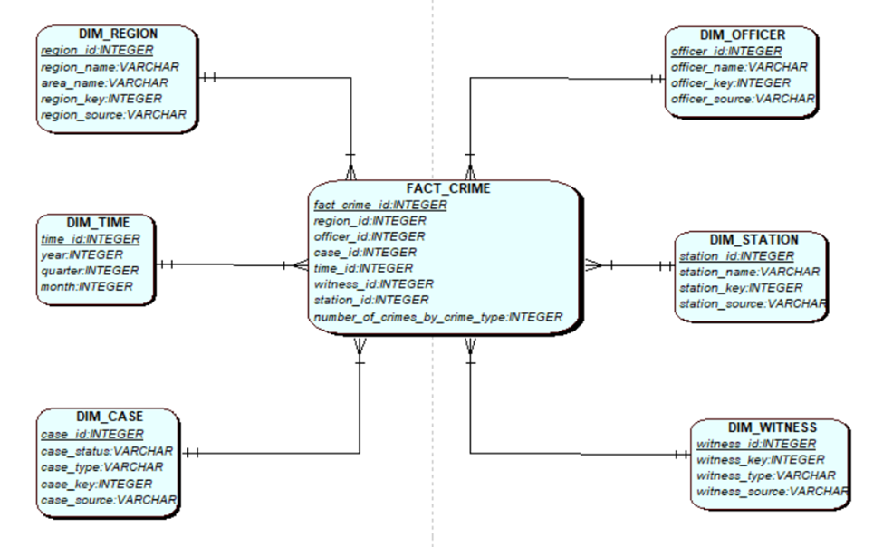
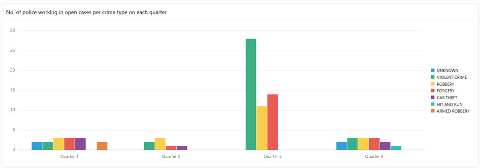
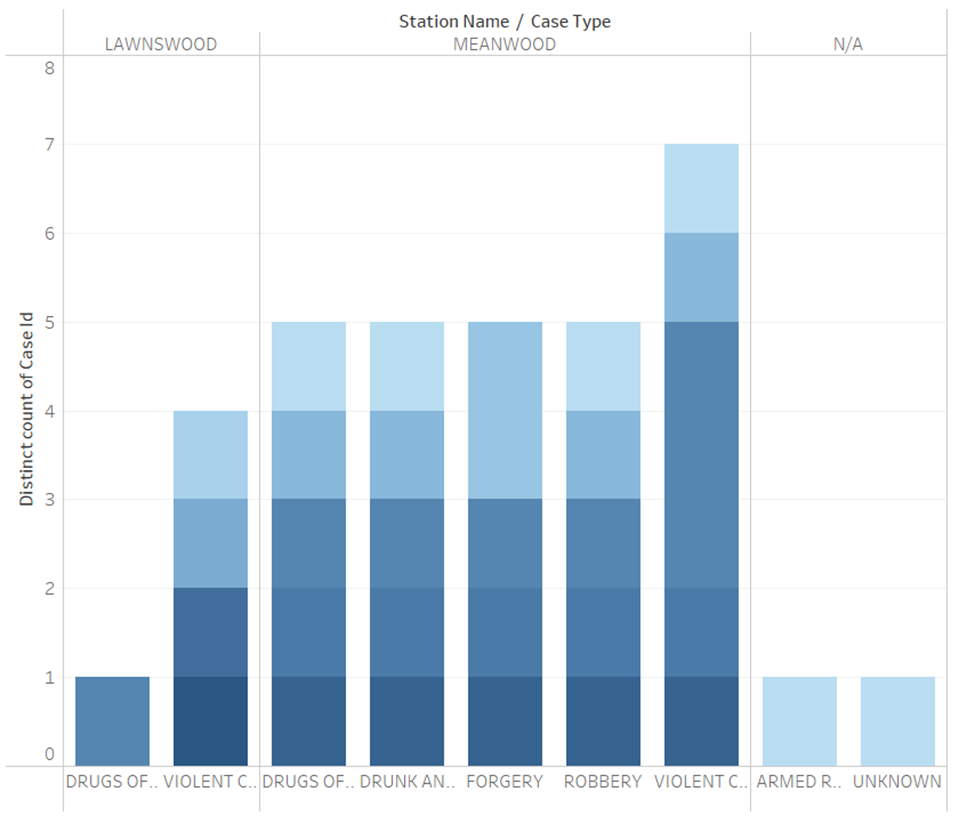

# Data Warehouse Project

## Project Overview

The project revolves around the police force of England and Wales. The police force uses multiple systems to facilitate their operation by keeping track of the crime cases. The systems help them keep track of crime based on regional area, leading officer and status of the case.
There are 2 systems and a spreadsheet that are being used to aid them in their task. The aim of the project is to design a Data Mart for the purpose of collecting and analyzing the data obtained from these sources. The police have considered following key performance indicators (KPI) for analysis:
1.	Reduce crime
2.	Close crime
3.	Identify areas with crime hotspots

This project focuses on the KPI of reduce crime which focuses on generating reports for the police with aim of reducing the total no. of crime.

## Prerequisites

1. Apex Oracle account. This application could also be done in a contanerized Oracle environment, however for convenience I would recommend using Apex Oracle.

## Star-schema design

The project utilizes the following star-schema to create a fact table which can allow for a comprehensive query incorporating all the data sources specified above.

*fig - star-schema structure*

## Setting up the star schema

Utilizing apex oracle will be the easiest way to setup this project without using Oracle terminal. It will allow for a simple

### Stages

#### Setting up oracle and source
1. Setup an oracle apex account.
2. Setup a source databases, using scripts provided in data sources folder.

#### Setting up dimension and fact table
1. Run the dimension_ddl script to setup the required database structure for the dimension tables and fact tables.

#### Setting up staging tables and populating them
1. Run the staging_DDL script to set up the staging area.
2. Run the staging_procedure_package to run the scripts that bring data to the staging area.

#### Setting up clean and bad tables and populating them
1. To setup the clean and bad tables for each dimension tables, we have clean_and_bad_DDL script.
2. For the purpose of this project we created create_bad_data script to simulate bad data in the data source.
3. Run filter_procedure_package to create the package with all filtering scripts.
3. Run run_filter_procedure to run all the scripts found in the filter_procedure_package to populate the clean and bad tables.
4. Run run_cleaning_procedure sql to clean bad data in the bad_table and send them to clean table.

#### Transformation table
The cleaned data must now be made consistent as they are derived from multiple sources.
1. Run the transformation_ddl script to create necessary structures for transformation table.
2. Run transformation_procedure_package, which contains all the transformation scripts.
3. Run run_transform_procedure scirpt to populate the transformation tables.

#### Loading into dimension table

1. The dimension tables have alreay been setup. If all the above steps were followed correctly, the insert_dimension_procedure script can populate the dimension tables and fact tables with correct data.

## Use Case
As long as the above instructions are followed sequentially, the data warehouse will be setup correctly and you can run intricate queries against the created fact table which would be cumbersome to do without this structure in place.

Figures generated using queries against the fact tables are demonstrated below.

*fig - no. of police working in open cases per crime type on each quarter*

*fig - no. of crime by crime-type by station in year 2016.*

